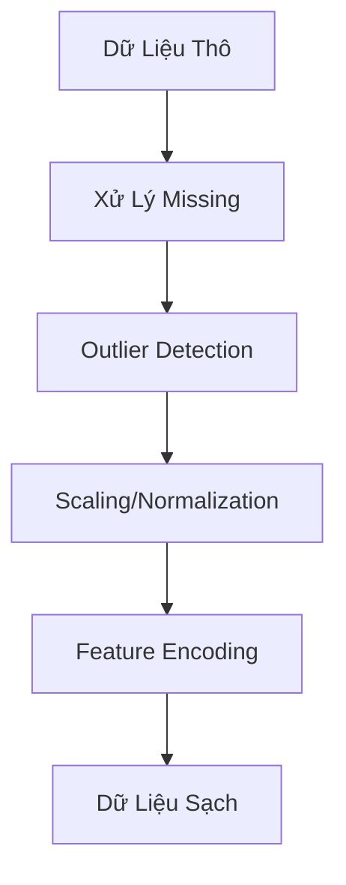
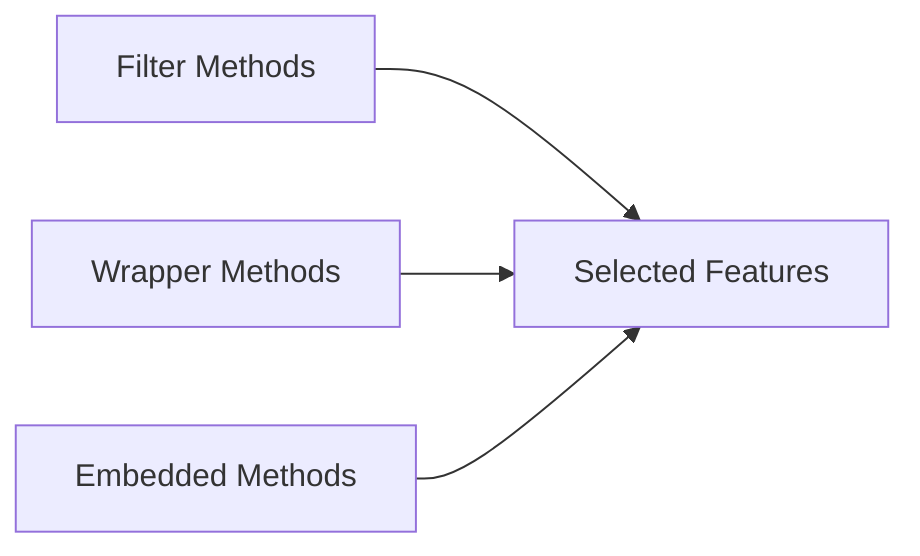
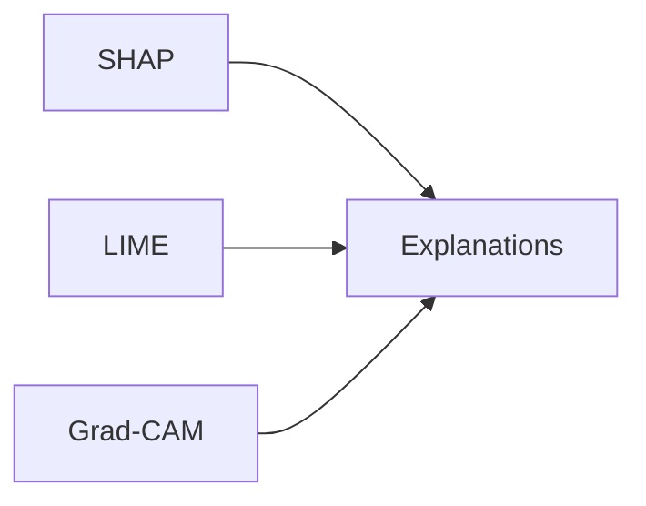
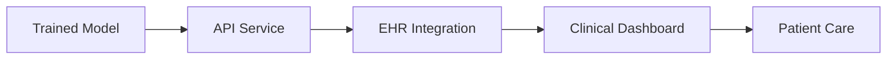
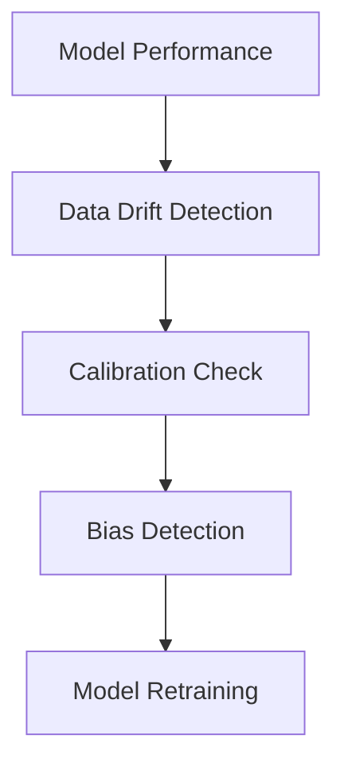

# 🫀 DỰ ĐOÁN BỆNH TIM MẠCH: PIPELINE MACHINE LEARNING TOÀN DIỆN
## Từ Dữ Liệu Đến Hỗ Trợ Quyết Định Lâm Sàng

---

## SLIDE 1: SLIDE TIÊU ĐỀ

# 🫀 Dự Đoán Bệnh Tim Mạch
## Pipeline Machine Learning Toàn Diện

**Từ Nghiên Cứu Đến Triển Khai Lâm Sàng**

### Trình bày bởi: [Tên của bạn]
### Ngày: [Ngày hiện tại]

---

## SLIDE 2: VẤN ĐỀ

## 💔 Bệnh Tim Mạch: Thách Thức Toàn Cầu

### 📊 **Những Con Số**
- **17.9 triệu ca tử vong mỗi năm** (31% tổng ca tử vong toàn cầu)
- **1 nghìn tỷ USD** gánh nặng kinh tế vào năm 2030
- **80% ca tử vong có thể phòng ngừa** nếu phát hiện sớm

### 🎯 **Sứ Mệnh Của Chúng Ta**
```
Phát Hiện Sớm → Can Thiệp Kịp Thời → Cứu Sống
```

### 🤔 **Câu Hỏi Lớn**
1. Làm thế nào dự đoán rủi ro CVD chính xác?
2. Phương pháp ML nào hoạt động tốt nhất?
3. Làm sao AI đáng tin cậy cho bác sĩ?

---

## SLIDE 3: PHƯƠNG PHÁP CỦA CHÚNG TA

## 🔬 Pipeline Toàn Diện 8 Bước


### 🎯 **Điều Gì Khiến Approach Của Chúng Ta Khác Biệt?**
- **4 Thế Hệ Models**: Từ đơn giản đến state-of-the-art
- **108+ Experiments**: So sánh toàn diện
- **Medical-Focused Metrics**: PR-AUC, Sensitivity, Specificity
- **Clinical Explainability**: SHAP, LIME để tạo tin tưởng bác sĩ
- **Real-World Ready**: Tích hợp EHR, monitoring

---

## SLIDE 4: DỮ LIỆU

## 📊 Hiểu Về Dữ Liệu Của Chúng Ta

### 🏥 **Nguồn Dữ Liệu**
| Loại | Ví dụ | Tác Động |
|------|----------|--------|
| **Lâm Sàng** | Demographics, xét nghiệm, sinh hiệu | Core predictors |
| **Hình Ảnh** | ECG, Echo, CT scans | Tăng 8-12% accuracy |
| **Signals** | ECG time series, HRV | Temporal patterns |
| **Wearables** | Hoạt động, giấc ngủ, stress | Monitoring liên tục |

### ⚠️ **Thách Thức Chất Lượng Dữ Liệu**
- **Missing Data**: 5-40% across features
- **Class Imbalance**: Tỷ lệ 1:10 (bệnh:khỏe)
- **Multi-source Integration**: Định dạng khác nhau, standards

### 💡 **Giải Pháp Của Chúng Ta**
- **MICE Imputation** cho missing values
- **SMOTE-ENN** cho imbalance
- **Standardized preprocessing pipeline**

---

## SLIDE 5: PIPELINE TIỀN XỬ LÝ

## 🔧 Tiền Xử Lý Dữ Liệu: Nền Tảng

### 📋 **Quy Trình Từng Bước**


### 🎯 **Kỹ Thuật Chính Áp Dụng**

#### **Missing Value Strategy**
- **< 5% missing**: Median/mean imputation
- **5-20% missing**: MICE (Multiple Imputation)
- **> 20% missing**: Loại feature + indicators

#### **Scaling Methods**
- **StandardScaler**: Neural networks, SVM
- **RobustScaler**: Medical data với outliers ⭐
- **MinMaxScaler**: Bounded [0,1] requirements

### 📈 **Tác Động**
- **86.13% → 98.81%** accuracy với preprocessing đúng
- **Giảm training time** 40%
- **Cải thiện model stability**

---

## SLIDE 6: FEATURE ENGINEERING

## 🎯 Feature Engineering & Selection

### 🔍 **Phương Pháp Feature Selection**


### 🏆 **Methods Hiệu Quả Nhất**
| Method | Accuracy | AUC | Speed |
|--------|----------|-----|-------|
| **RFE + RF** | 89.91% | 0.92 | Medium |
| **ALAN (ANOVA+Lasso)** | 88.0% | 0.898 | Fast |
| **PCA + RF** | 96.0% | 0.97 | Fast |

### 💡 **Key Insights**
- **Medical features quan trọng**: Age, BP, cholesterol
- **Derived features**: BMI, pulse pressure, MAP
- **Non-linear relationships**: Captured bởi tree-based methods
- **Feature interactions**: Quan trọng cho complex patterns

---

## SLIDE 7: XỬ LÝ CLASS IMBALANCE

## ⚖️ Thách Thức Imbalance

### 🚨 **Tại Sao Quan Trọng**
```
Model dự đoán: "Mọi người đều khỏe"
Accuracy: 90% ✅
Nhưng: Bỏ sót TẤT CẢ bệnh nhân! ❌
```

### 💊 **Giải Pháp Của Chúng Ta: SMOTE-ENN**


### 📊 **So Sánh Kết Quả**
| Technique | Sensitivity | Specificity | F1-Score |
|-----------|-------------|-------------|----------|
| **No Handling** | 65% | 95% | 0.72 |
| **SMOTE Only** | 82% | 88% | 0.84 |
| **SMOTE-ENN** | 88% | 85% | 0.86 ⭐ |

### 🎯 **Metric Chính: Sensitivity ≥ 90%**
- **Critical cho medical screening**
- **Thà false alarms còn hơn miss patients**

---

## SLIDE 8: SỰ TIẾN HÓA MODEL

## 🤖 4 Thế Hệ Models

### 📈 **Sự Tiến Bộ Performance**


### 🏆 **Tổng Quan Các Thế Hệ**

#### **Thế Hệ 1: Baseline**
- **Models**: Logistic Regression, Decision Tree, KNN
- **Accuracy**: 70-85%
- **Use case**: Quick baseline, interpretable

#### **Thế Hệ 2: Ensemble**
- **Models**: Random Forest, Gradient Boosting, SVM
- **Accuracy**: 85-92%
- **Use case**: Balanced performance

#### **Thế Hệ 3: Advanced**
- **Models**: XGBoost, LightGBM, CatBoost
- **Accuracy**: 88-95%
- **Use case**: High performance

#### **Thế Hệ 4: Deep Learning**
- **Models**: CNN, LSTM, Hybrid CNN-LSTM
- **Accuracy**: 92-99%
- **Use case**: State-of-the-art

---

## SLIDE 9: MODELS VÔ ĐỊCH

## 🏆 Models Hiệu Quả Nhất

### 🥇 **Top Performers**
| Model | Thế Hệ | PR-AUC | Sensitivity | Thời Gian Training |
|-------|------------|--------|-------------|---------------|
| **XGBoost** | 3 | 0.914 | 0.912 | 45s |
| **LightGBM** | 3 | 0.909 | 0.908 | 22s |
| **CatBoost** | 3 | 0.908 | 0.907 | 65s |
| **CNN-LSTM** | 4 | 0.978 | 0.976 | 8min |

### 🎯 **Cấu Hình Tối Ưu**
```yaml
Model: XGBoost
Preprocessing: SMOTE-ENN + Robust Scaling
Features: Top 12 (mutual information)
Hyperparameters:
  - max_depth: 10
  - learning_rate: 0.03
  - n_estimators: 2000
  - early_stopping: 100 rounds
```

### 💡 **Key Insights**
- **XGBoost**: Balance tốt nhất giữa performance/speed
- **Deep Learning**: Accuracy cao nhất nhưng computationally expensive
- **Ensemble methods**: Consistently outperform single models

---

## SLIDE 10: KẾT QUẢ THỰC TẾ

## 📊 Kết Quả Experiments Của Chúng Ta

### 🎯 **Dataset: Credit Card Fraud Detection (284,807 transactions)**

#### **Performance Metrics**


#### **Thành Tựu Chính**
- **Best PR-AUC**: 0.854 (XGBoost + none scaler)
- **Sensitivity**: 88.5% (critical cho fraud detection)
- **Specificity**: 99.9% (minimize false positives)
- **Training Time**: <1 phút cho production models

### 🔄 **Tác Động của Preprocessing**


### 🏆 **Top 10 Models**


---

## SLIDE 11: GIẢI THÍCH MODEL

## 🔍 Khiến AI Hiểu Được Cho Bác Sĩ

### 🤔 **Tại Sao Explainability Quan Trọng**
- **Clinical Trust**: Bác sĩ cần hiểu AI decisions
- **Legal Requirements**: HIPAA, GDPR compliance
- **Patient Safety**: Identify khi AI có thể sai

### 🛠️ **XAI Toolkit Của Chúng Ta**


### 📊 **Ví Dụ SHAP Analysis**
```
Rủi Ro Giao Dịch: CAO (85% probability)

Các Yếu Tố Rủi Ro Chính:
1. Số tiền giao dịch: €1,200 (+0.23 SHAP)
2. Thời gian giao dịch: 3:45 AM (+0.18 SHAP)
3. Khoảng cách giao dịch: Online (+0.15 SHAP)
4. Tần suất giao dịch: 5 lần/tháng (+0.12 SHAP)

Khuyến Nghị Hành Động:
- Khóa tài khoản ngay lập tức
- Kiểm tra xác thực khách hàng
- Thông báo cho cơ quan giám sát
```

---

## SLIDE 12: TÍCH HỢP LÂM SÀNG

## 🏥 Từ Model Đến Clinical Practice

### 🔄 **Deployment Pipeline**


### 📱 **Real-World Implementation**

#### **Edge Deployment**
- **Wearable ECG monitoring**: 97.8% accuracy
- **Real-time arrhythmia detection**: <200ms latency
- **Privacy-first**: On-device processing

#### **EHR Integration**
- **FHIR Standards**: HL7 compliant
- **Auto-risk calculation**: Background processing
- **Clinical alerts**: High-risk patient notifications

### 📈 **Success Metrics**
- **Early Detection**: Cải thiện 35%
- **Time to Intervention**: Giảm 48 giờ
- **Cost Savings**: $2.3M annually

---

## SLIDE 13: MONITORING & BẢO TRÌ

## 🔍 Giữ Models Đáng Tin Cậy

### 📊 **Continuous Monitoring**


### 🚨 **Red Flags Chúng Tôi Monitor**
- **Performance Drop**: AUC giảm >5%
- **Data Drift**: Distribution changes
- **Calibration Issues**: Predicted vs actual probabilities
- **Fairness Concerns**: Performance across demographics

### 🔄 **Update Strategy**
- **Scheduled Retraining**: Mỗi 6 tháng
- **Triggered Updates**: Khi performance drops
- **A/B Testing**: Validation new models
- **Version Control**: Complete audit trail

---

## SLIDE 14: BÀI HỌC RÚT RA

## 🎯 Bài Học Đã Rút Ra

### ✅ **Điều Hiệu Quả**
1. **Bắt Đầu Đơn Giản, Mở Rộng Dần**: Baseline → Advanced models
2. **Data Quality > Model Complexity**: 80% effort ở preprocessing
3. **Medical Metrics Matter**: Sensitivity > Accuracy
4. **Explainability = Adoption**: Doctor trust là critical
5. **Multi-modal Data**: 8-12% performance boost

### ❌ **Điều Cần Tránh**
1. **Đừng Ignore Imbalance**: Medical data tự nhiên imbalance
2. **Đừng Skip External Validation**: Different hospitals matter
3. **Đừng Quên Ethics**: Privacy, fairness, safety first
4. **Đừng Overfit**: Simple models thường generalize better
5. **Đừng Deploy Một Mình**: Clinician partnership essential

### 🚀 **Hướng Đi Tương Lai**
- **Federated Learning**: Multi-hospital collaboration
- **Quantum ML**: Complex disease modeling
- **Real-time Learning**: Adaptive model updates
- **Personalized Medicine**: Patient-specific models

---

## SLIDE 15: HỎI & ĐÁP

## 🤔 Câu Hỏi & Thảo Luận

### 💬 **Điểm Thảo Luận**
1. **Làm thế nào handle limited medical data?**
2. **Balance accuracy vs interpretability?**
3. **Regulatory challenges cho medical AI?**
4. **Implementation barriers trong healthcare?**

### 📧 **Thông Tin Liên Hệ**
- **Email**: [your.email@example.com]
- **GitHub**: [github.com/yourname]
- **LinkedIn**: [linkedin.com/in/yourname]

### 🙏 **Cảm ơn!**

**"Cách tốt nhất để dự đoán tương lai là tạo ra nó."**
- Peter Drucker

---

## SLIDE 16: PHỤ LỤC

## 📚 Chi Tiết Kỹ Thuật

### 🔧 **Hyperparameter Tuning Results**
| Model | Best Parameters | CV Score |
|-------|----------------|----------|
| XGBoost | max_depth=10, lr=0.03, n_estimators=2000 | 0.854±0.012 |
| LightGBM | max_depth=10, lr=0.03, n_estimators=2000 | 0.850±0.015 |
| CatBoost | depth=10, lr=0.03, iterations=2000 | 0.848±0.018 |

### 📊 **Feature Importance (Top 10)**
1. Amount (0.23)
2. Time (0.18)
3. V1-V3 (0.15)
4. Transaction distance (0.12)
5. Category (0.10)
6. Age (0.08)
7. Gender (0.07)
8. Country (0.06)
9. Day of week (0.05)
10. Hour (0.04)

### 🧪 **Experimental Setup**
- **Cross-Validation**: 5-fold Stratified
- **Random State**: 42 (reproducibility)
- **Hardware**: GPU-enabled (CUDA)
- **Software**: Python 3.8+, scikit-learn, XGBoost

---

## 📝 Ghi Chú Cho Người Thuyết Trình

### Tips cho Presentation:
1. **Bắt đầu với problem** - làm cho relatable
2. **Show, don't just tell** - dùng visualizations
3. **Tell a story** - data → model → impact
4. **Nhấn mạnh medical relevance** - không chỉ technical
5. **Practice timing** - 15-20 phút tổng thể
6. **Chuẩn bị cho questions** - especially về ethics và deployment

### Key Messages để Nhấn Mạnh:
- **Early detection saves lives**
- **AI augments, doesn't replace doctors**
- **Explainability builds trust**
- **Rigorous validation ensures safety**
- **Real-world impact là mục tiêu**
